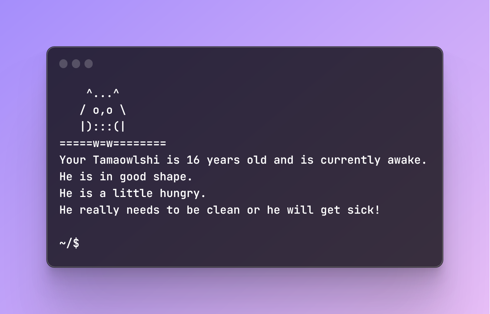

<div align="center">
  <h1><code>Tamaowlchi</code></h1>
  <strong>Your new little (owl) tamagotchi companion.</strong>
  <br/>
  <br/>
  
</div>


### Summary
I took inspiration from the repository https://github.com/DuncanMcArdle/tamagotchi-cli/tree/master.

_The Tamagotchi CLI application is a command-line driven version of the classic Tamagotchi game. Players will attempt to grow an alien Tamagotchi from birth to death, whilst feeding, resting, healing and cleaning up after it along the way._


### Installation
Automatic installation is not available yet so you need to manually install it:

Find and download the latest binary for your os from the [release page](https://github.com/Alustrat/tamaowlshi/releases). Extract the executable from the archive and move the executable to a folder that is included in your `$PATH`. This will let you call the `tamaowlchi` command from everywhere (you may need to re-open your terminal first).

Edit your `.zshrc`, `.bashrc` or `.profile` to include the following line:
```
tamaowlshi status
```
This will give you news about your tamaowlshi every time you open a new terminal and prevent you for forgetting him.

### Usage

Start by creating a new tamaowlshi using `tamaowlshi new`, then you can run `tamaowlshi status` to see how it goes. If your tamaowlshi die, you can create another one with the same `tamaowlshi new` command.

Available commands to take care of your tamaowlshi are:
```
~$ tamaowlshi --help

Usage: tamaowlchi <COMMAND>

Commands:
  new     Create a new tamaowlchi. Only if you don't have any tamaowlchi alive
  clean   Remove all your tamaowlchi poops
  feed    Restore the food of your tamaowlchi to 50
  heal    Restore the heal of your tamaowlchi to 50
  sleep   Put your tamaowlchi to bed
  wake    Wake up your tamaowlchi
  status  Get your tamaowlchi status
  help    Print this message or the help of the given subcommand(s)

Options:
  -h, --help     Print help
  -V, --version  Print version
```